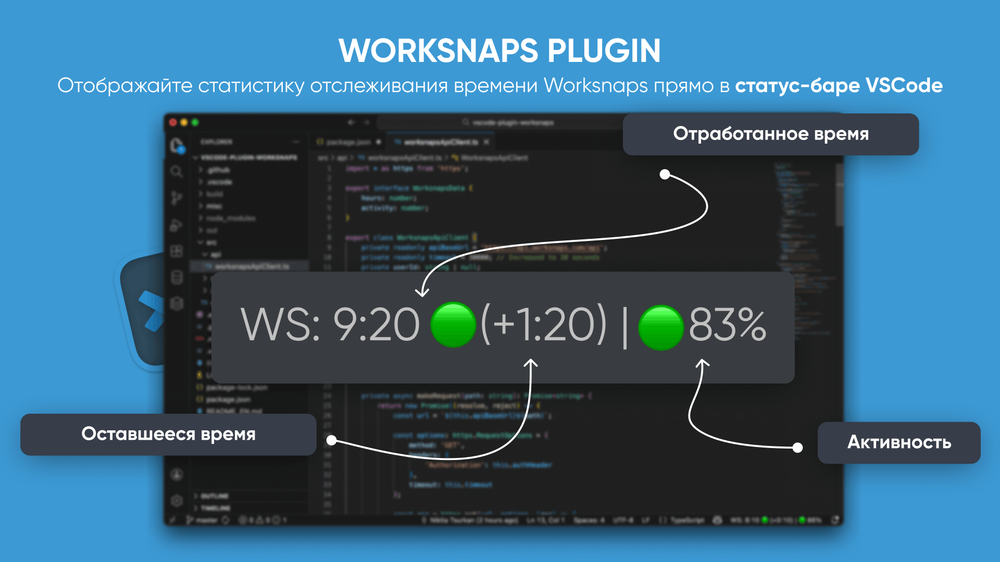

# Worksnaps Time Tracker for VSCode

[Русский](README.md) | [English](README_EN.md)



---


Display your Worksnaps time tracking statistics directly in the VSCode status bar.

## Features

- 📊 Real-time display of worked hours for today
- 🎯 Activity percentage with color coding (green ≥80%, yellow 60-79%, red <60%)
- ⏱️ Remaining time until target hours (configurable, default: 8 hours)
- 🔄 Automatic refresh every 60 seconds (configurable)
- 💾 Caching for reliability when API is unavailable
- ⚙️ Fully customizable display format
- 🖱️ Click on widget to manually refresh

## Display Example

Status bar shows: `WS: 9:30 -3:10 | ✓ 87%`

Where:
- `9:30` = worked hours today (hours:minutes, rounded to 10-minute intervals)
- `-3:10` = 3 hours 10 minutes remaining
- `✓ 87%` = activity percentage (✓ for ≥80%, ⚠ for 60-79%, ✗ for <60%)

## Requirements

- VSCode 1.74 or later
- Active Worksnaps account with API access
- Node.js 18 or later (for extension development only)

## Installation

### Manual Installation from VSIX

1. Download the latest `.vsix` release from [Releases](https://github.com/curkan/vscode-plugin-worksnaps/releases)
2. Open VSCode
3. Go to **Extensions** (Ctrl+Shift+X / Cmd+Shift+X)
4. Click the `...` menu (three dots) in the upper right corner
5. Select **Install from VSIX...**
6. Select the downloaded `.vsix` file

### Build from Source

```bash
# Clone the repository
git clone https://github.com/curkan/vscode-plugin-worksnaps.git
cd vscode-plugin-worksnaps

# Install dependencies
npm install

# Compile the extension
npm run compile

# Create VSIX package (optional)
npm install -g @vscode/vsce
vsce package
```

## Configuration

### 1. Get Your API Token

1. Log in to your Worksnaps account
2. Go to **Profile & Settings → Web Service API**
3. Click "Show my API Token"
4. Copy the token

### 2. Get Your Project ID

You can find your project ID in two ways:

**Option A: From URL**
- Open your project in Worksnaps web interface
- The project ID is in the URL: `https://app.worksnaps.com/projects/YOUR_PROJECT_ID`

**Option B: Via API**
```bash
curl -u "YOUR_API_TOKEN:" https://api.worksnaps.com/api/projects.xml
```

### 3. Configure the Extension

1. Open VSCode
2. Go to **Settings** (Ctrl+, / Cmd+,)
3. Search for "Worksnaps" or navigate to **Extensions → Worksnaps Time Tracker**
4. Enter your configuration:
   - **Api Token** (required): Your Worksnaps API token
   - **Project Id** (required): Your Worksnaps project ID
   - **User Id** (optional): Leave empty for auto-detection
   - **Update Interval**: How often to refresh data (default: 60 seconds)
   - **Target Hours**: Your daily work goal (default: 8 hours)
   - **Display Options**: Choose what to show in the status bar

**Alternative**: Use the **Worksnaps: Open Settings** command via Command Palette (Ctrl+Shift+P / Cmd+Shift+P)

## Usage

Once configured, the extension will automatically display your Worksnaps statistics in the VSCode status bar (bottom right).

### Status Bar Display

The widget shows:
- Prefix (customizable, default: "WS:")
- Worked time (if enabled)
- Remaining time with arrow (if enabled)
- Activity percentage with icon (if enabled)
- Warning indicator (⚠) if using cached data due to API error

### Click Actions

Click on the widget in the status bar to manually refresh the data.

### Commands

Available via Command Palette (Ctrl+Shift+P / Cmd+Shift+P):

- **Worksnaps: Refresh Data** - Manually refresh data
- **Worksnaps: Open Settings** - Open Worksnaps settings

### Display States

- `WS: N/A` - API token or Project ID not configured
- `WS: Loading...` - Fetching data from API
- `WS: 4:50 ↓ -3:10 | ⚠ 78%` - Normal display
- `WS: 8:30 ↑ +0:30 | ✓ 85%` - Overtime (30 minutes over target)
- `WS: 4:50 ↓ -3:10 | ⚠ 78% $(warning)` - Using cached data due to API error
- `WS: $(warning) Error` - API error and no cached data available

## Settings Reference

| Setting | Default | Description |
|---------|---------|-------------|
| `worksnaps.apiToken` | (empty) | Your Worksnaps API token (required) |
| `worksnaps.projectId` | (empty) | Your Worksnaps project ID (required) |
| `worksnaps.userId` | (empty) | Your user ID (optional, auto-detected if empty) |
| `worksnaps.updateInterval` | 60 | Refresh interval in seconds (30-600) |
| `worksnaps.targetHours` | 8 | Daily work goal in hours (1-24) |
| `worksnaps.prefix` | "WS:" | Text shown before statistics |
| `worksnaps.showTime` | true | Display worked hours |
| `worksnaps.showActivity` | true | Display activity percentage |
| `worksnaps.showRemaining` | true | Display remaining time until target |

### Editing via settings.json

You can configure the extension directly in `settings.json`:

```json
{
  "worksnaps.apiToken": "your_api_token_here",
  "worksnaps.projectId": "your_project_id",
  "worksnaps.userId": "",
  "worksnaps.updateInterval": 60,
  "worksnaps.targetHours": 8,
  "worksnaps.showTime": true,
  "worksnaps.showActivity": true,
  "worksnaps.showRemaining": true,
  "worksnaps.prefix": "WS:"
}
```

## Troubleshooting

### Widget shows "WS: N/A"

**Solution**: Configure your API token and project ID in **Settings → Extensions → Worksnaps**

### Widget shows "WS: $(warning) Error"

Possible causes:
- Invalid API token
- Invalid project ID
- No internet connection
- Worksnaps API is down

**Solution**:
1. Verify your API token is correct
2. Verify your project ID is correct
3. Check your internet connection
4. Test API manually:
   ```bash
   curl -u "YOUR_TOKEN:" https://api.worksnaps.com/api/projects.xml
   ```
5. Open Developer Console (Help → Toggle Developer Tools) and check logs

### Data not updating

**Solution**:
1. Click on the widget to manually refresh
2. Use **Worksnaps: Refresh Data** command
3. Check the update interval in settings
4. Reload VSCode

### Wrong activity percentage

**Note**: Worksnaps calculates activity based on keyboard and mouse usage. The extension shows the average activity across all 10-minute time entries for today.

### Extension not showing

**Solution**:
1. Ensure the extension is installed and enabled in **Extensions**
2. Check that the status bar is visible (View → Appearance → Status Bar)
3. Reload VSCode

## How It Works

1. Extension fetches time entries from Worksnaps API for the current day
2. Calculates total worked hours and average activity percentage
3. Results are cached for 60 seconds
4. If API is unavailable, uses cached data with warning indicator
5. Status bar updates automatically based on configured interval
6. When settings change, data is automatically refreshed

## API Usage

- **Endpoint**: `https://api.worksnaps.com/api/projects/{project_id}/time_entries.xml`
- **Authentication**: HTTP Basic Auth (API token as username, empty password)
- **Rate Limiting**: Extension uses caching to minimize API requests
- **Data Format**: XML (parsed using regex)
- **HTTP Client**: axios

## Privacy & Security

- Your API token is stored in VSCode settings
- Extension only reads time entry data for your configured project
- No data is sent to third parties
- All API communication is over HTTPS
- Source code is open and available for review

## Development

### Environment Setup

```bash
# Clone repository
git clone https://github.com/curkan/vscode-plugin-worksnaps.git
cd vscode-plugin-worksnaps

# Install dependencies
npm install

# Run compilation in watch mode
npm run watch
```

### Running in Development Mode

1. Open the project in VSCode
2. Press `F5` or use **Run → Start Debugging**
3. A new VSCode window will open with the extension installed
4. Test the functionality

### Project Structure

```
vscode-plugin-worksnaps/
├── src/
│   ├── api/
│   │   └── worksnapsApiClient.ts    # API client for Worksnaps
│   ├── service/
│   │   └── worksnapsService.ts      # Service with caching and auto-refresh
│   ├── ui/
│   │   └── statusBarItem.ts         # Status bar widget
│   └── extension.ts                 # Extension entry point
├── out/                              # Compiled files
├── .vscode/
│   ├── launch.json                  # Debug configuration
│   └── tasks.json                   # Build tasks
├── package.json                     # Extension manifest
├── tsconfig.json                    # TypeScript configuration
└── README.md                        # Documentation
```

### Building

```bash
# Compile
npm run compile

# Compile in watch mode
npm run watch

# Lint
npm run lint

# Create VSIX package
vsce package
```

### Debugging

1. Set breakpoints in the code
2. Press `F5` to launch in debug mode
3. Use the extension in the new VSCode window
4. Logs are available in the Debug Console of the original VSCode window

## Contributing

Contributions are welcome! Please feel free to submit a Pull Request.

1. Fork the repository
2. Create your feature branch (`git checkout -b feature/amazing-feature`)
3. Commit your changes (`git commit -m 'Add amazing feature'`)
4. Push to the branch (`git push origin feature/amazing-feature`)
5. Open a Pull Request

## Related Projects

- [phpstorm-plugin-worksnaps](https://github.com/curkan/phpstorm-plugin-worksnaps) - Worksnaps plugin for PhpStorm
- [tmux-plugin-worksnaps](https://github.com/curkan/tmux-plugin-worksnaps) - Worksnaps plugin for tmux

## License

MIT License - see [LICENSE](LICENSE) file for details

## Acknowledgments

- Inspired by [phpstorm-plugin-worksnaps](https://github.com/curkan/phpstorm-plugin-worksnaps)
- Built with [VSCode Extension API](https://code.visualstudio.com/api)

## Support

If you encounter issues, please report them on GitHub:
https://github.com/curkan/vscode-plugin-worksnaps/issues

## Changelog

### 1.0.0 (Initial Release) - 2026-01-27

- ✨ Display worked hours in status bar
- 🎯 Show activity percentage with color coding
- ⏱️ Show remaining time until target
- ⚙️ Configurable settings via VSCode Settings
- 🔄 Auto-refresh with caching
- 🖱️ Click to manually refresh
- 📋 Commands via Command Palette
- 🌍 Support for Russian and English languages

---

**Happy coding! 🚀**
